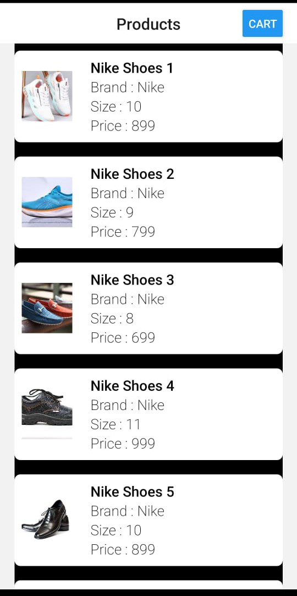
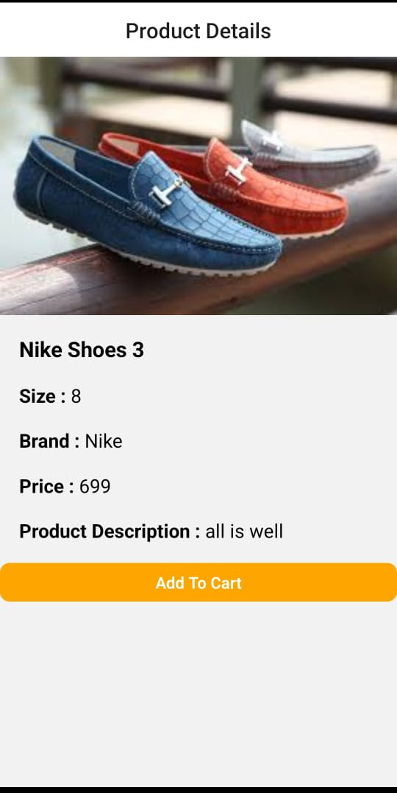
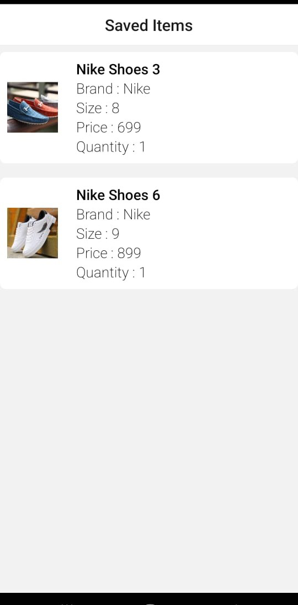

# Storing App

Welcome to the Store App! This app is an idea of basic shopping App. 

<h2>  Technology Used</h2>
<ul>
  <li> React-Native : Programming language for implementing app logic </li>
  <li> Redux: State management library for managing global app state </li>
  <li>Other languages which are during the intialisation of App</li>
</ul>

<h2 >Installation</h2>

To run the Store App locally on your machine, follow these steps:

<ol>
  <li>First pull the code into yout device</li>
  <li> Navigate to the project directory: cd store-app </li>
  <li> type command : npx react-native start </li>
  <li> for android drag and drop the android folder into the android studio </li>
  <li> run the emulator or your own device by connecting it using USB </li>
     (your mobile and pc should be connected from the same WLAN) 
  <li> open Command Prompt and type ipconfig</li>
  <li> you will get the ip address of the wifi then shake your app for while  go to setting and change the ip address like ((ip address of your wifi):8081) </li>
  <li> Again open the App </li>
</ol>

  Contributions are welcome!   thanks to visit on my repository

 
 

